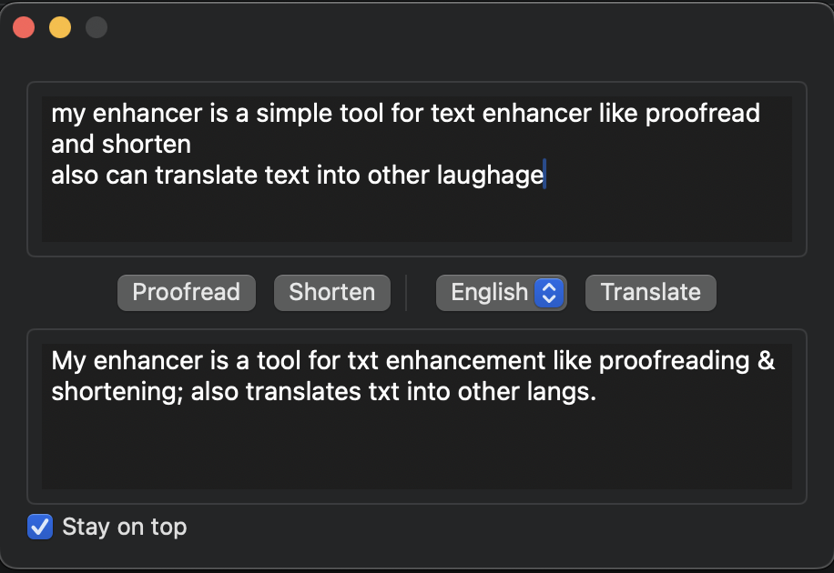

# MyEnhancer

MyEnhancer is a macOS application that helps you enhance and transform text using AI capabilities. It provides features like proofreading, shortening text, and translation between multiple languages.

## Download

## Screenshots

## Features

- **Proofreading**: Check and improve your text for grammar, spelling and style
- **Text Shortening**: Condense your text while maintaining key information
- **Translation**: Translate text between multiple languages including:
  - English
  - Simplified Chinese
  - Japanese
  - Korean
  - Arabic
  - German

## Technical Details

- Built with SwiftUI for macOS
- Supports multiple AI providers:
  - OpenAI integration
  - Grok integration
- Configurable API settings
- "Stay on Top" window mode

## Setup

1. Get an API key from your preferred AI provider (OpenAI or Grok)
2. Launch the app and go to Settings
3. Enter your API key and select your preferred model
4. Start using the text enhancement features

## Usage

1. Enter or paste your text in the input field
2. Choose an operation:
   - Click "Proofread" to check and improve the text
   - Click "Shorten" to create a concise version
   - Select a target language and click "Translate" for translation
3. The enhanced text will appear in the output field

## Requirements

- macOS 11.0 or later
- Valid API key from OpenAI or Grok

## Privacy

This application processes text through your chosen AI provider's API. Please review their privacy policies regarding data handling and storage.

**by AI Agent**

## 功能特点

- **文本校对**: 检查并改进文本的语法、拼写和风格
- **文本精简**: 在保留关键信息的同时压缩文本长度
- **翻译功能**: 支持多种语言之间的互译，包括：
  - 英语
  - 简体中文
  - 日语
  - 韩语
  - 阿拉伯语
  - 德语

## 技术细节

- 使用 SwiftUI 构建的 macOS 应用
- 支持多个 AI 服务提供商：
  - OpenAI 集成
  - Grok 集成
- 可配置的 API 设置
- "保持窗口置顶"模式

## 设置步骤

1. 从您选择的 AI 提供商(OpenAI 或 Grok)获取 API 密钥
2. 启动应用并进入设置
3. 输入您的 API 密钥并选择首选模型
4. 开始使用文本增强功能

## 使用方法

1. 在输入框中输入或粘贴文本
2. 选择操作：
   - 点击"校对"检查并改进文本
   - 点击"精简"创建简洁版本
   - 选择目标语言并点击"翻译"进行翻译
3. 增强后的文本将显示在输出框中

## 系统要求

- macOS 11.0 或更高版本
- 来自 OpenAI 或 Grok 的有效 API 密钥

## 隐私说明

本应用程序通过您选择的 AI 提供商的 API 处理文本。请查看他们关于数据处理和存储的隐私政策。

