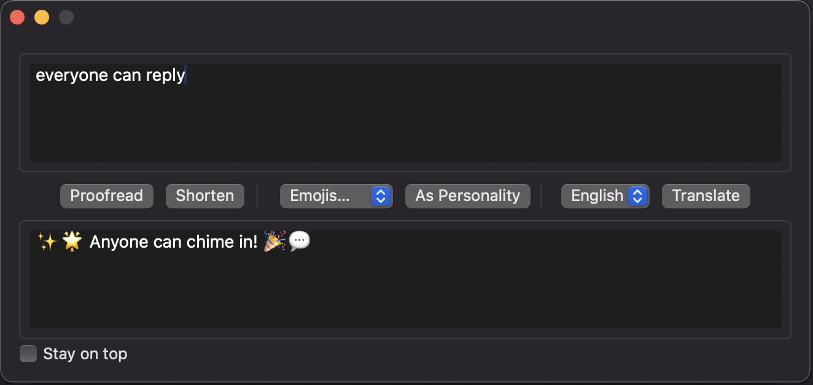

# MyEnhancer

MyEnhancer is a macOS application that helps you enhance and transform text using AI capabilities. It provides features like proofreading, shortening text, and translation between multiple languages.

## Screenshots

## Features

- **Proofreading**: Check and improve your text for grammar, spelling and style
- **Text Shortening**: Condense your text while maintaining key information
- **Translation**: Translate text between multiple languages including:
  - English
  - Simplified Chinese
  - Japanese
  - Korean
  - Arabic
  - German

## Technical Details

- Built with SwiftUI for macOS
- Supports multiple AI providers:
  - OpenAI integration
  - Grok integration
- Configurable API settings
- "Stay on Top" window mode

## Setup

1. Get an API key from your preferred AI provider (OpenAI or Grok)
2. Launch the app and go to Settings
3. Enter your API key and select your preferred model
4. Start using the text enhancement features

## Usage

1. Enter or paste your text in the input field
2. Choose an operation:
   - Click "Proofread" to check and improve the text
   - Click "Shorten" to create a concise version
   - Select a target language and click "Translate" for translation
3. The enhanced text will appear in the output field

## Requirements

- macOS 11.0 or later
- Valid API key from OpenAI or Grok

## Privacy

This application processes text through your chosen AI provider's API. Please review their privacy policies regarding data handling and storage.
